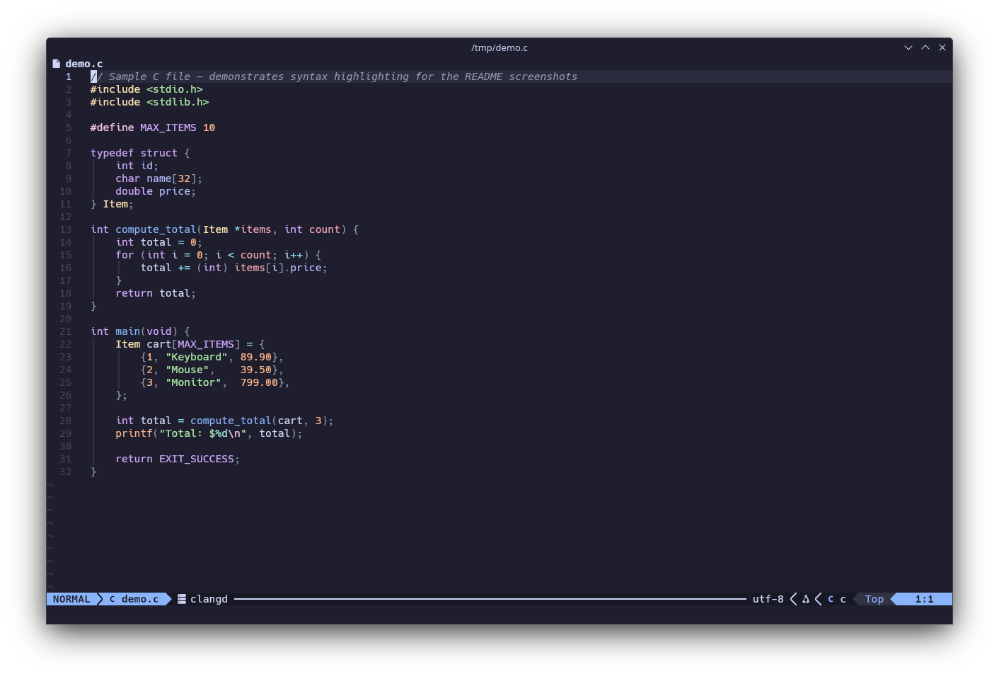
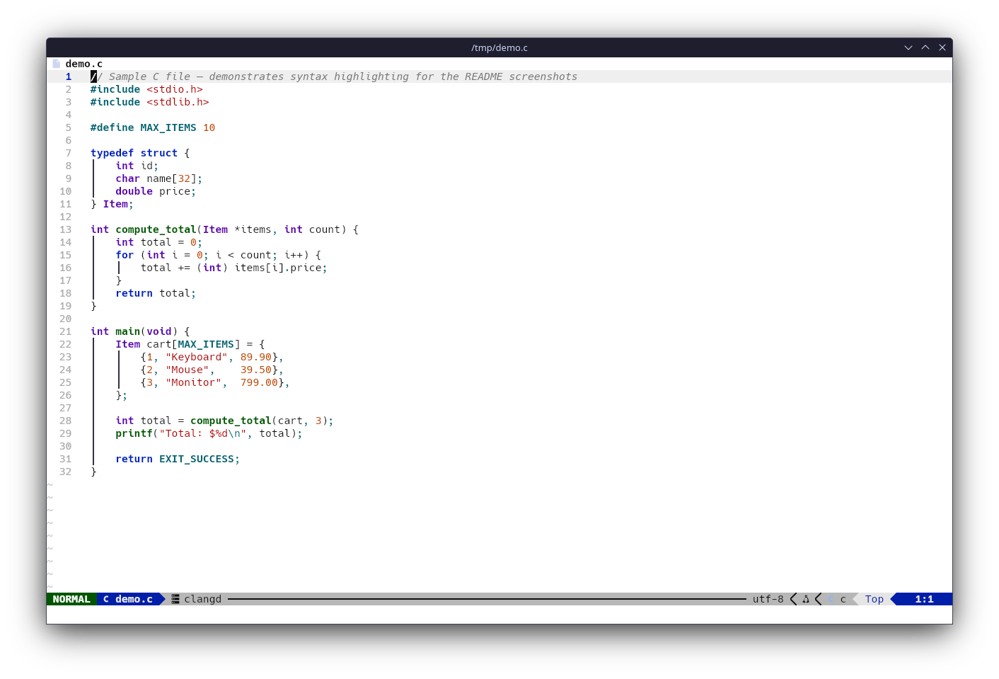
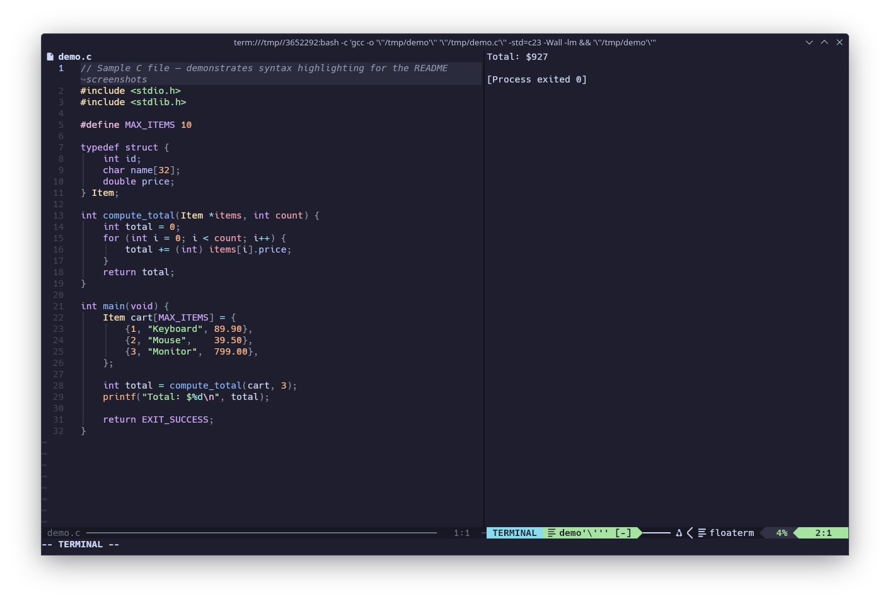

# LazyVim-Setup

Personal Neovim configuration based on [LazyVim](https://www.lazyvim.org/), with:

- **Neovim-Qt** and **Neovide** as optional GUIs
- Floating terminal splits via `vim-floaterm` (F4)
- One-key code runner for 15+ languages (F5/F6)
- DAP debugger for Python and C (F7–F12)
- Auto dark/light theme from system preference
- Custom light theme `wbs` — optimised for classroom projectors
- Hack Nerd Font

> Tested on **Debian Trixie · KDE Plasma · Wayland**.

---

## Screenshots

<table>
<tr>
<td></td>
<td></td>
</tr>
<tr>
<td align="center"><sub>Dark — <code>catppuccin-mocha</code></sub></td>
<td align="center"><sub>Light — <code>wbs</code> (projector-friendly)</sub></td>
</tr>
<tr>
<td colspan="2"></td>
</tr>
<tr>
<td colspan="2" align="center"><sub>F5 code runner — vsplit with floating terminal output</sub></td>
</tr>
<tr>
<td colspan="2"></td>
</tr>
<tr>
<td colspan="2" align="center"><sub>Statusline — mode, filename, LSP client, encoding, cursor position</sub></td>
</tr>
</table>

---

## Quick start

```bash
git clone https://github.com/wyllianbs/LazyVim-Setup.git
cd LazyVim-Setup
chmod +x install.sh
./install.sh
```

The script auto-detects whether this is a fresh install or an update.  
Force a specific mode with `--install` or `--update`.

---

## What `install.sh` does

| Step | Action |
|------|--------|
| 1 | `apt` packages (build tools, clangd, Qt6, Node, Lua, Fish…) |
| 2 | **Neovim** — latest official binary from GitHub Releases |
| 3 | **Neovim-Qt** — compiled from source (latest tag) |
| 4 | **Neovide** — latest official binary from GitHub Releases |
| 5 | **Hack Nerd Font** — latest release |
| 6 | npm globals: `pnpm`, `pyright`, `tree-sitter-cli`, `mermaid-cli` |
| 7 | Python: `pynvim` |
| 8 | Copies `nvim/` → `~/.config/nvim/` *(install only)* |
| 9 | Cleans stale plugin state *(install only)* |
| 10 | Headless `:Lazy sync` + `:TSUpdate` |

`.desktop` launchers are installed to `/usr/local/share/applications/` for
all three editors. Symlinks land in `/usr/local/bin/`.

The install prefix for binaries (`/opt` by default) and which editors to
install are chosen interactively at startup.

### Update mode

```bash
./install.sh --update
```

- Skips config deployment (your `~/.config/nvim` is untouched)
- Skips any binary already at the latest version
- Runs `:Lazy sync`, `:Lazy update`, `:TSUpdate`

---

## Repository layout

```
LazyVim-Setup/
├── install.sh          — install / update script
├── README.md
└── nvim/               — drop into ~/.config/nvim/
    ├── init.lua
    ├── ginit.vim       — Neovim-Qt / Neovide GUI settings
    ├── colors/
    │   └── wbs.lua     — custom light theme
    └── lua/
        ├── config/
        │   ├── dap.lua
        │   ├── keymaps.lua
        │   ├── lazy.lua
        │   ├── lualine-config.lua
        │   ├── settings.lua
        │   └── which-key.lua
        └── plugins/
            ├── colorscheme.lua
            └── plugins.lua
```

---

## First-run checklist (inside Neovim)

```vim
:Lazy sync            " install all plugins
:TSUpdate             " compile Treesitter parsers
:LazyHealth           " check for missing dependencies
:MasonInstall debugpy " Python debugger adapter
```

---

## Code runner (F5 / F6)

Detects the buffer's filetype and runs it in a `vim-floaterm` window.
Saves the file automatically before running.

| Language | Run (F5) | Interactive (F6) |
|---|---|---|
| C | `gcc -std=c23 -Wall -lm` → run | — |
| C++ | `g++ -std=c++23 -Wall` → run | — |
| Java | `javac` → `java ClassName` | — |
| Python | `python3 -B` | `python3 -Bi` |
| JavaScript | `node` | `node -i -e "$(cat …)"` |
| TypeScript | `npx ts-node` | — |
| Lua | `lua` | — |
| Bash / Sh | `bash` / `sh` | — |
| Ruby | `ruby` | `irb -r` |
| Go | `go run` | — |
| Rust | `rustc` → run | — |
| PHP | `php` | — |
| Perl | `perl` | — |
| R | `Rscript` | — |
| Julia | `julia` | — |
| Kotlin | `kotlinc` → `java -jar` | — |

Layout variants:

| Shortcut | Layout |
|---|---|
| `F5` / `F6` | vertical split |
| `Shift+F5` / `Shift+F6` | horizontal split |
| `Ctrl+Shift+F5` / `Ctrl+Shift+F6` | floating window |

---

## Theme

| Command | Result |
|---|---|
| `<leader>tt` or `:ToggleTheme` | Toggle dark ↔ light |
| `:colorscheme catppuccin-mocha` | Dark (default) |
| `:colorscheme wbs` | Light — projector-friendly |

On startup the theme is chosen automatically from the system preference
(`gsettings get org.gnome.desktop.interface color-scheme`).

---

## Key shortcuts

`<leader>` = **Space**

### Terminal (vim-floaterm)

| Key | Action |
|---|---|
| `F4` | Vertical split terminal (toggle) |
| `Shift+F4` | Horizontal split terminal (toggle) |
| `Ctrl+Shift+F4` | Floating terminal (toggle) |

### Debugger (DAP)

| Key | Action |
|---|---|
| `F7` | Toggle breakpoint |
| `F8` | Continue |
| `F9` | Step over |
| `F10` | Step into |
| `F11` | Step out |
| `F12` | Terminate |

### GUI (Neovim-Qt / Neovide, `ginit.vim`)

| Key | Action |
|---|---|
| `Ctrl+=` | Increase font size |
| `Ctrl+-` | Decrease font size |
| `Ctrl+0` | Reset font to size 11 |
| Right-click | Context menu (copy / cut / paste) |

---

## Installed automatically by Lazy / Mason

**LSP:** `pyright` (Python), `clangd` (C/C++)  
**DAP:** `debugpy` (Python), `gdb` (C)  
**Formatters:** `black`, `isort`, `autopep8` (Python) · `clang-format` (C/C++) · `stylua` (Lua) · `shfmt` (Shell)  
**Treesitter parsers:** bash, c, diff, html, javascript, json, lua, markdown, python, typescript, vim, yaml, and more.

Full plugin list: see [`nvim/lua/plugins/plugins.lua`](nvim/lua/plugins/plugins.lua) and [`nvim/lua/config/lazy.lua`](nvim/lua/config/lazy.lua).
